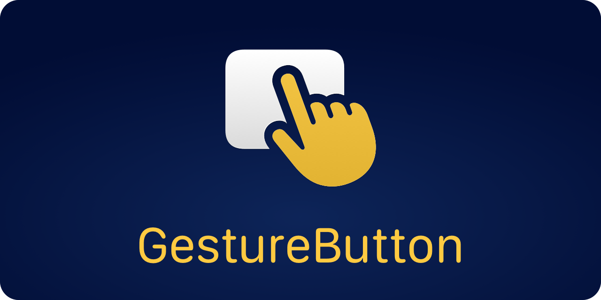

<p align="center">
    
</p>

<p align="center">
    
    
    
    
    <a href="https://twitter.com/danielsaidi"></a>
    <a href="https://mastodon.social/@danielsaidi"></a>
</p>


## About GestureButton

GestureButton is a SwiftUI button that can trigger many different gesture actions.

You can use a ``GestureButton`` just like a regular `Button` and specify different actions for different gestures that you want to handle:

```swift
struct ContentView: View {

    @State private var isPressed = false
    
    var body: some View {
        GestureButton(
            isPressed: $isPressed,
            pressAction: { print("Pressed") },
            releaseInsideAction: { print("Released Inside") },
            releaseOutsideAction: { print("Released Outside") },
            longPressAction: { print("Long Pressed") },
            doubleTapAction: { print("Double Tapped") },
            repeatAction: { print("Repeating Action") },
            dragStartAction: { value in print("Drag Started") },
            dragAction: { value in print("Drag \(value)") },
            dragEndAction: { value in print("Drag Ended") },
            endAction: { print("Gesture Ended") }
        ) { isPressed in
            Color.yellow // You can use any button content view.
        }
    }
}
```

You can customize various delays and timeouts to change how the button behaves, for instance the max time between two taps for the taps to count as a double-tap. You can use any `View` as button label.


## How to use GestureButton within a ScrollView

A ``GestureButton`` works within a `ScrollView` as well, but need some extra handling to behave well.

### iOS 17

In iOS 17 and earlier, you have to pass in a ``GestureButtonScrollState`` instance into the ``GestureButton`` initializer, for the button to not block the scroll gesture.

### iOS 18

In iOS 18 and later, you don't have to use a ``GestureButtonScrollState`` if you're fine with the scroll view and the button detecting all gestures simultaneously. Note that this may however trigger undesired actions when the user scrolls the scroll view. 

To make the scroll view block button gestures while scrolling, and for button gestures to stop the scroll view from scrolling, you can use a ``GestureButtonScrollState`` and apply it to both the scroll view and to all gesture buttons within:

```swift
struct ContentView: View {

    @StateObject private var scrollState = GestureButtonScrollState()
    
    var body: some View {
        ScrollView(.horizontal) {
            GestureButton(
                scrollState: scrollState,
                pressAction: { print("Pressed") },
                label: { isPressed in
                    Color.yellow // You can use any button content view.
                }
            )
        }
        .scrollGestureState(scrollState)
    }
}
```

Future versions of this library should aim to streamline this setup, to only require the view modifier. 


## Installation

GestureButton can be installed with the Swift Package Manager:

```
https://github.com/danielsaidi/GestureButton.git
```

GestureButton supports iOS, iPadOS, macOS, watchOS, and visionOS.


## Documentation

The [online documentation][Documentation] has more information, articles, code examples, etc.


## Demo Application

The demo app lets you explore the library. To try it out, just open and run the `Demo` project.


## Support my work 

You can [sponsor me][Sponsors] on GitHub Sponsors or [reach out][Email] for paid support, to help support my [open-source projects][OpenSource].

Your support makes it possible for me to put more work into these projects and make them the best they can be.


## Contact

Feel free to reach out if you have questions or if you want to contribute in any way:

* Website: [danielsaidi.com][Website]
* Mastodon: [@danielsaidi@mastodon.social][Mastodon]
* Twitter: [@danielsaidi][Twitter]
* E-mail: [daniel.saidi@gmail.com][Email]


## License

GestureButton is available under the MIT license. See the [LICENSE][License] file for more info.


[Email]: mailto:daniel.saidi@gmail.com

[Website]: https://danielsaidi.com
[GitHub]: https://github.com/danielsaidi
[Twitter]: https://twitter.com/danielsaidi
[Mastodon]: https://mastodon.social/@danielsaidi
[OpenSource]: https://danielsaidi.com/opensource
[Sponsors]: https://github.com/sponsors/danielsaidi

[Documentation]: https://danielsaidi.github.io/GestureButton
[Getting-Started]: https://danielsaidi.github.io/GestureButton/documentation/gesturebutton/getting-started
[License]: https://github.com/danielsaidi/GestureButton/blob/master/LICENSE
