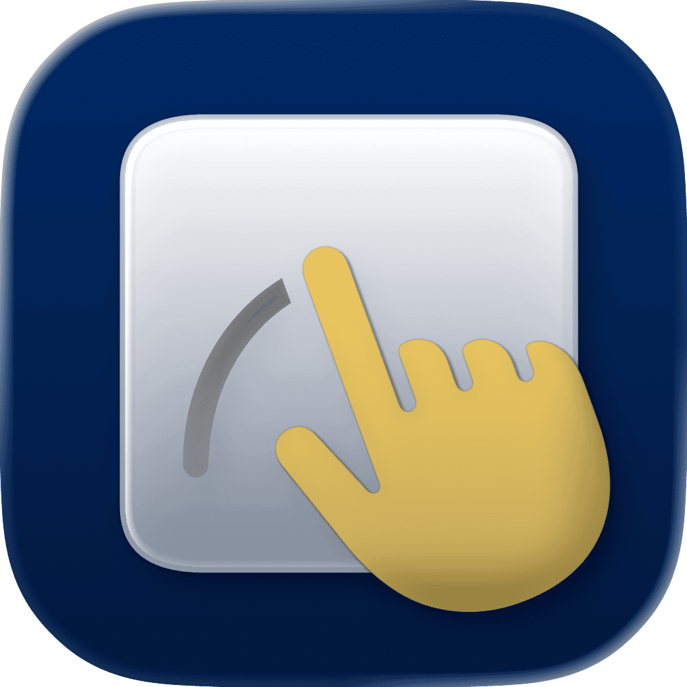

<p align="center">
    
</p>

<p align="center">
    
    
    <a href="https://danielsaidi.github.io/GestureButton"></a>
    <a href="https://github.com/danielsaidi/GestureButton/blob/master/LICENSE"></a>
    <a href="https://github.com/sponsors/danielsaidi"></a>
</p>


# GestureButton

GestureButton can trigger many different actions with a single gesture.

You can use a ``GestureButton`` just like a regular `Button`, and can define different actions for different gestures:

```swift
struct ContentView: View {

    @State private var isPressed = false
    
    var body: some View {
        GestureButton(
            isPressed: $isPressed,
            pressAction: { print("Pressed") },
            releaseInsideAction: { print("Released Inside") },
            releaseOutsideAction: { print("Released Outside") },
            longPressAction: { print("Long Pressed") },
            doubleTapAction: { print("Double Tapped") },
            repeatAction: { print("Repeating Action") },
            dragStartAction: { value in print("Drag Started") },
            dragAction: { value in print("Drag \(value)") },
            dragEndAction: { value in print("Drag Ended") },
            endAction: { print("Gesture Ended") }
        ) { isPressed in
            Color.yellow // You can use any button content view.
        }
        .gestureButtonConfiguration(...)
    }
}
```

You can pass in custom configurations to change how the button behaves, e.g. the max time between two taps for the taps to count as a double-tap. You can use any content `View` as the button label, based on the `isPressed` state.


## Installation

GestureButton can be installed with the Swift Package Manager:

```
https://github.com/danielsaidi/GestureButton.git
```


## Support My Work

You can [become a sponsor][Sponsors] to help me dedicate more time on my various [open-source tools][OpenSource]. Every contribution, no matter the size, makes a real difference in keeping these tools free and actively developed.


## Documentation

The online [documentation][Documentation] has more information, articles, code examples, etc.


## Demo Application

The `Demo` folder has a demo app that lets you explore the library and its components.


## Contact

Feel free to reach out if you have questions or if you want to contribute in any way:

* Website: [danielsaidi.com][Website]
* E-mail: [daniel.saidi@gmail.com][Email]
* Bluesky: [@danielsaidi@bsky.social][Bluesky]
* Mastodon: [@danielsaidi@mastodon.social][Mastodon]


## License

GestureButton is available under the MIT license. See the [LICENSE][License] file for more info.


[Email]: mailto:daniel.saidi@gmail.com
[Website]: https://danielsaidi.com
[GitHub]: https://github.com/danielsaidi
[OpenSource]: https://danielsaidi.com/opensource
[Sponsors]: https://github.com/sponsors/danielsaidi

[Bluesky]: https://bsky.app/profile/danielsaidi.bsky.social
[Mastodon]: https://mastodon.social/@danielsaidi
[Twitter]: https://twitter.com/danielsaidi

[Documentation]: https://danielsaidi.github.io/GestureButton
[Getting-Started]: https://danielsaidi.github.io/GestureButton/documentation/gesturebutton/getting-started
[License]: https://github.com/danielsaidi/GestureButton/blob/master/LICENSE
